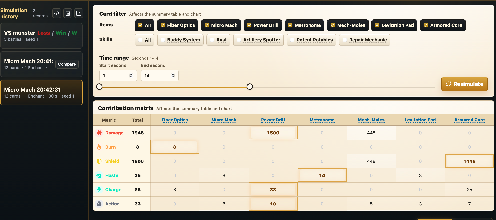

# BazaarInsight

[English](README.md)

BazaarInsight 是 The Bazaar 的本地离线战斗模拟器和战斗数据分析工具。支持打桩模拟和怪物战斗模拟。游戏 Mod 内嵌一键模拟按钮，可以直接从游戏内发起模拟。

## 下载

BazaarInsight 目前暂时不开源。这个仓库当前只用于发布安装包、自动更新元数据和问题反馈。

请从 [Releases](../../releases) 下载最新版安装包。

当前安装包暂未签名。

macOS：安装后需要先在终端运行：

```bash
xattr -r -d com.apple.quarantine /Applications/BazaarInsight.app
```

如果安装在其他位置，请把 `/Applications/BazaarInsight.app` 替换成实际 App 路径。

## 功能截图

### 中文界面


### 英文界面


